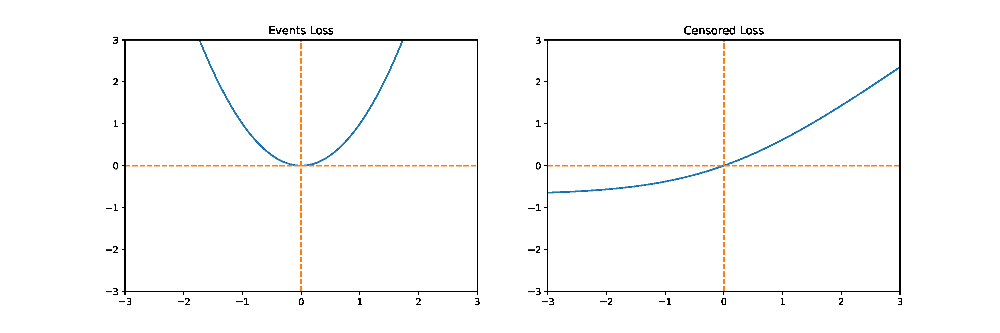

# Improving Concordance Index in Regression-based Survival Analysis: Evolutionary Discovery of Loss Function for Neural Networks

The official repository for the paper "Improving Concordance Index in Regression-based Survival Analysis: Evolutionary Discovery of Loss Function for Neural Networks" accepted at GECCO 2024.


## BibTeX Citation
```
@inproceedings{10.1145/3638530.3664129,
author = {Altarabichi, Mohammed Ghaith and Alabdallah, Abdallah and Pashami, Sepideh and R\"{o}gnvaldsson, Thorsteinn and Nowaczyk, S\l{}awomir and Ohlsson, Mattias},
title = {Improving Concordance Index in Regression-based Survival Analysis: Evolutionary Discovery of Loss Function for Neural Networks},
year = {2024},
isbn = {9798400704956},
publisher = {Association for Computing Machinery},
address = {New York, NY, USA},
url = {https://doi.org/10.1145/3638530.3664129},
doi = {10.1145/3638530.3664129},
pages = {1863–1869},
numpages = {7},
keywords = {neuroevolution, evolutionary meta-learning, loss function, neural networks, survival analysis, concordance index, genetic algorithms},
location = {Melbourne, VIC, Australia},
series = {GECCO '24 Companion}
}
```


For each dataset (Nwtco, Flchain, Support), there are 6 notebooks. Run each of them to do the following: 

1. #### Search_[dataset_name]_LossRepeated: 
    Experiment to optimize the full function f(x)+g(x), repeated 10 times.

2. #### Search_[dataset_name]_LossRepeated_Fix_Left: 
    Experiment to optimize the censored part g(x) and fixing the events part to f(x)=x^2, repeated 10 times..

3. #### Search_[dataset_name]_LossRepeated_Fix_Right: 
    Experiment to optimize the events part f(x) and fixing the censored part to g(x)=max(0,x)^2, repeated 10 times..

4. #### Search_[dataset_name]_LossRepeated_Left_Right: 
    Comparison between the results of the optimization of the Full function f(x)+g(x), fixing g(x), and fixing f(x). You need to copy the results from the first three notebooks.

5. #### Softplus_Study_[dataset_name]: 
    Comparison between MSCEsp and the truncated MSCEsp.

6. #### Search_[dataset_name]_LossRepeated_Left_Right_LogSig: 
    Comparison between optimization and MSCEsp fucntion. . You need to copy the results from the previous (1, 2, 3, and 5) notebooks.


